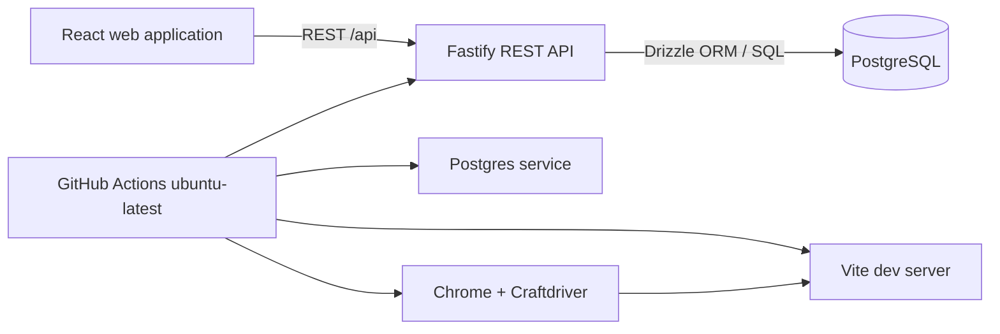

# Technical design

## System boundary



The browser is untrusted. It may render questions but does not receive answer keys for an active attempt. Fastify authenticates a secure session cookie, loads the user/role from Postgres, and calculates all scores on the server. PostgreSQL is private to the API: it has no browser-accessible port outside the local development network.

## Repository shape

```text
apps/
  web/              Vite React application
    src/            routes, features, components, API client
  api/              Fastify server, REST handlers and services
    src/            auth, exams, attempts, teacher functions
packages/
  contracts/        shared DTOs, route schemas and error-code types
  grading/          pure grading functions, shared by API tests only
database/
  migrations/       ordered SQL/Drizzle migrations
  seed.ts           deterministic development and CI demo data
  drizzle.config.ts
tests/
  api/              REST integration and authorisation tests
  e2e/              Craftdriver browser scenarios
docker-compose.yml  PostgreSQL (and later optional Redis/MinIO)
.github/workflows/ci.yml
spec/               product and implementation documents
```

## Data model

Application tables carry `created_at`, `updated_at`, UUID primary keys, and a non-secret external-facing ID where useful. API database credentials are server-only.

| Table | Important fields | Notes |
| --- | --- | --- |
| `users` | `id`, `email`, `password_hash`, `display_name`, `role`, `is_active` | Role is `student`, `teacher`, or `admin`; hash using Argon2id; email is unique/case-normalized. |
| `sessions` | `id`, `user_id`, `token_hash`, `expires_at`, `revoked_at` | The browser receives an opaque, secure, HttpOnly cookie; only a hash is stored. |
| `exams` | `owner_id`, `title`, `instructions`, `status`, `duration_minutes`, `available_from`, `available_until`, `feedback_policy` | Mutable teacher-owned draft metadata. |
| `exam_revisions` | `exam_id`, `revision_number`, `snapshot_json`, `published_at` | Immutable canonical exam snapshot. An attempt points here. |
| `questions` | `exam_id`, `position`, `kind`, `prompt`, `points`, `config_json` | Draft authoring rows. `config_json` stores options/numeric settings, never exposed with keys during an active attempt. |
| `question_answers` | `question_id`, `answer_json`, `explanation` | Correct answers; separate table and restricted to owner/server. |
| `attempts` | `student_id`, `exam_revision_id`, `status`, `started_at`, `submitted_at`, `score`, `max_score` | Status: `in_progress`, `submitted`, `expired`. One active attempt per student/revision initially. |
| `attempt_answers` | `attempt_id`, `question_key`, `answer_json`, `is_correct`, `awarded_points` | Answer data and grading outcome. |
| `audit_events` | `actor_id`, `event_type`, `entity_type`, `entity_id`, `metadata` | Record publish, submit and teacher actions; avoid putting answer content into logs. |

Snapshots contain a question ID/key, prompt, options, points and grading configuration as needed by the server. They must never be re-generated from mutable draft rows at submission time.

## REST API

| Endpoint | Caller | Contract |
| --- | --- | --- |
| `POST /api/auth/login` / `POST /api/auth/logout` | Anonymous / authenticated | Validates credentials, starts/revokes opaque session. Rate-limited. |
| `GET /api/me` | Authenticated | Returns the current safe profile/role. |
| `GET /api/student/exams` | Student | Lists published exams and own status only. |
| `POST /api/student/exams/:id/start` | Student | Validates availability/attempt limit, selects current revision, creates or returns active attempt, returns question presentation only. |
| `PUT /api/student/attempts/:id/answers/:key` | Student | Validates ownership/state/question input; upserts answer. |
| `POST /api/student/attempts/:id/submit` | Student | Locks attempt, grades atomically, writes score/outcomes, returns permitted feedback. |
| `GET /api/teacher/exams` / `POST /api/teacher/exams` | Teacher | Lists owned exams / creates a draft. |
| `PATCH /api/teacher/exams/:id` | Teacher | Updates a teacher-owned draft; validates payload. |
| `POST /api/teacher/exams/:id/publish` | Teacher | Validates all questions, builds immutable revision, marks published atomically. |
| `POST /api/teacher/exams/:id/unpublish` | Teacher | Stops new attempts without altering existing ones. |
| `GET /api/teacher/exams/:id/results` | Teacher | Paginated aggregate result view for owned exam. |

Use a versioned payload schema validated by Zod in the React forms and Fastify routes. Return typed error codes (`UNAUTHENTICATED`, `FORBIDDEN`, `INVALID_STATE`, `VALIDATION_ERROR`, `NOT_FOUND`) rather than exposing database messages. During local development Vite proxies `/api` to Fastify, so browser tests use one origin and do not require CORS exceptions.

## Grading rules

- Single choice: selected option ID equals the correct option ID.
- Multiple choice: selected option-ID set exactly equals correct set; no partial credit in PoC.
- Numeric: parse a normalized finite number and mark correct when `abs(answer - expected) <= tolerance`; defaults to `0` tolerance.
- Blank or malformed input is incorrect; it does not prevent submission.
- Total score is the sum of awarded points. Persist outcomes and score, not merely a recomputable total.

## Security and privacy baseline

- The database is reachable only by the API. Enforce access control in Fastify services and test every role/resource/action combination.
- Never put `DATABASE_URL`, session secrets, password hashes or API credentials in Vite environment variables or the browser bundle.
- Derive user/role from the verified server session/database, never from client-provided role/owner IDs.
- Use Argon2id; never log a password, token, answer key or session cookie. Store only session-token hashes.
- Rate-limit sign-in and command endpoints; validate payload size and input shape.
- Keep audit records for publish/submission/teacher access; set a retention policy before production.
- Collect minimal student data: name/display name and email. Add a privacy notice, data export/deletion procedure and backup/restore plan before serving real schools.

## Quality and testing

- Unit: grading and schema validation, including tolerance/edge cases.
- Component: question inputs, submission confirmation, teacher validation.
- Integration: migrations + REST authorisation tests using separate seeded student/teacher sessions.
- End-to-end (Craftdriver): student completes exam; teacher authors/publishes; cross-user access is denied. Tests drive a real Chrome session against the actual Vite/API/DB stack.
- CI gates: format, lint, typecheck, unit tests, migrations, API integration, Vite build and Craftdriver browser suite.
